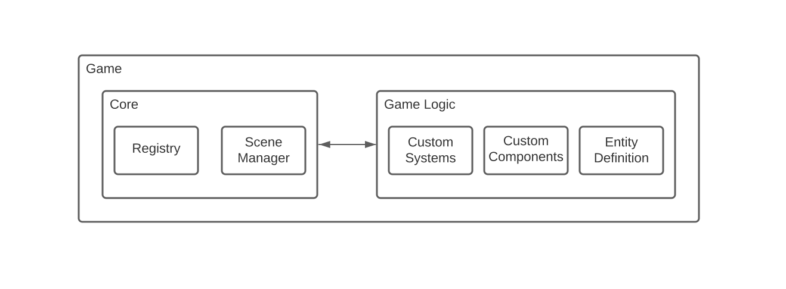

# Core

The `GameEngine::Core` is the entry point to use the Game Engine. It would be used to register your scenes, set the frame rate, etc.

[](../assets/Engine-Diagram.svg)

## Basic Example

```cpp
#include <iostream>
#include "GameEngine/Core.hpp"
#include "GameEngine/loaders/Json.hpp"

int main()
{
    std::cout << "Create the core engine" << std::endl;
    GameEngine::Core core;

    GameEngine::Loaders::Json parser = GameEngine::Loaders::Json(core);

    std::cout << "Gathering the game data" << std::endl;
    parser.loadFromFile("src/config.json");

    core.showProfiler(true); // Display in an second window stats like FPS, UPS, etc.

    while (core.isRunning()) {
        core.update();
    }
    return 0;
}
```

Same but with hardcoded data:

```cpp
#include <iostream>
#include "GameEngine/Core.hpp"

int main()
{
    std::cout << "Create the core engine" << std::endl;
    GameEngine::Core core;

    GameEngine::Scene scene = GameEngine::Scene("menu", "R-Type Menu", 1920, 1080);

    GameEngine::Registry::Entity background = core.registry.createEntity("background");

    core.registry.addComponent(background, GameEngine::Components::Position(0, 0));
    core.registry.addComponent(background, GameEngine::Components::Size(1920, 1080));
    core.registry.addComponent(background, GameEngine::Components::Sprite("assets/background.png"));
    core.registry.addComponent(background, GameEngine::Components::Display(true));

    scene.addEntity(background);

    core.sceneManager.addScene(scene);
    core.sceneManager.load("menu");

    core.showProfiler(true); // Display in an second window stats like FPS, UPS, etc.

    while (core.isRunning()) {
        core.update();
    }
    return 0;
}
```

## Usage

The `GameEngine::Core` in constructor create a [`GameEngine::Registry`](registry.md) which store all the entities of the game and a [`GameEngine::SceneManager`](scene_manager.md) which load and unload assets on scene changes.

This two objects are accessible trough the `GameEngine::Core` object as follow:

```cpp
GameEngine::Core core;
core.registry; // Registry
core.sceneManager; // SceneManager
```

### Game loop

The best way to create a game loop is shown as the example above. The `GameEngine::Core` object has a `isRunning` method which return `true` if the game is running and `false` if it's not. Also it's provide an update method which update the game engine.

```cpp
while (core.isRunning()) {
    core.update();
}
```

### Frequency

You can set the frequency of the game from the core object. The frequency is the number of update per second. The default value is 60. The update method can be called at any time and will only update on the right frequency. You should make sure to call the update method at least once per frame.

```cpp
core.setFrequency(30); // Set the frequency to 30 updates per second

while (core.isRunning()) {
    core.update(); //  Will return imeadiatly if the last update was less than 1/30 seconds ago
    /// Do some work here
}
```
