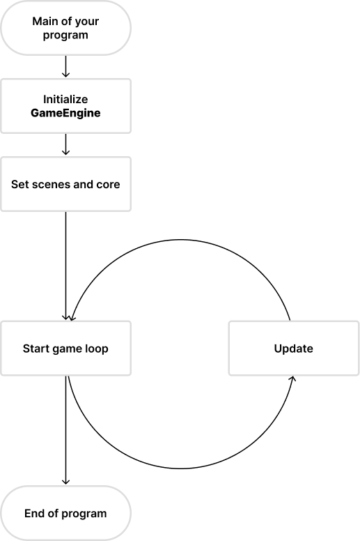
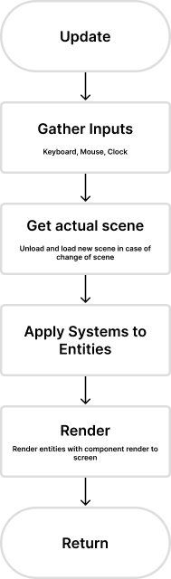

# Life Cycle

The Game Engine can be tricky to understand at first, but once you get the hang of it, it's pretty simple. The Game Engine is made up of a few different parts, and each part has a different purpose. The Game Engine is made up of the following parts:

- Registry (Stores all the entities)
- Scene Manager (Manages all the scenes)
- Scene (A namespace for entities)
- Core (Let you setup the engine and run it)

## Main

## Update

