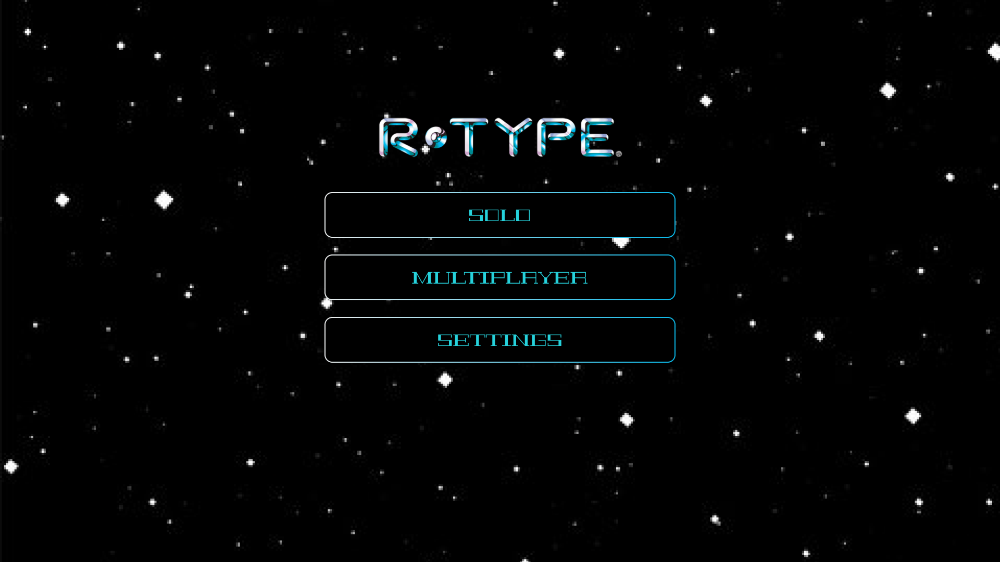
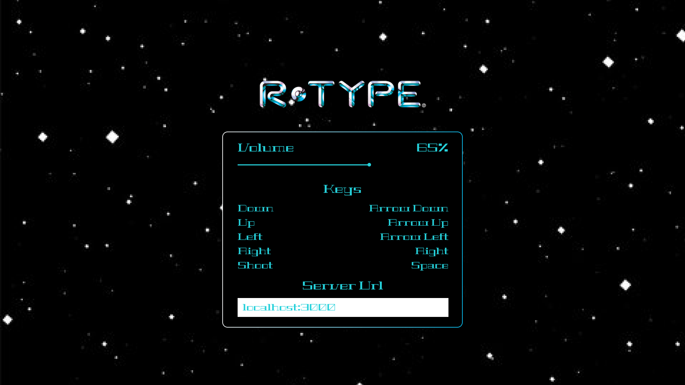

# User Guide

R-Type is a shoot'em up game where you control a spaceship and fight against aliens. You can play alone or with friends. Here are the guids to install, config and enjoy the game.

## How to install

### 🪟 Windows

As any other softwares you can just download this exe file and play

| Target | Client                  | Server                  |
| ------ | ----------------------- | ----------------------- |
| 64 Bit | [R-Type Client 64bit]() | [R-Type Server 64bit]() |
| 32 Bit | [R-Type Client 32bit]() | [R-Type Server 64bit]() |

### 🐧 Linux

#### AppImage

Download and run the AppImage

| Client            | Server            |
| ----------------- | ----------------- |
| [R-Type Client]() | [R-Type Server]() |

#### Build from source

You can build the game from source. To do this go check the [client](client/index.md) and [server](server/index.md) documentation.

## How to play

### 🎮 Controls

Here are the default settings you can always change them in the settings menu.

| Action     | Key         |
| ---------- | ----------- |
| Move Up    | Arrow Up    |
| Move Down  | Arrow Down  |
| Move Left  | Arrow Left  |
| Move Right | Arrow Right |
| Shoot      | Space       |

### 🕹️ Sole & Multiplayer

#### Solo

You can play without no connection needed. Just launch the game in solo mode and enjoy.

#### Multiplayer

You can play with your friends. To do this you simply need to go to:

_Create a lobby:_

Select "Multiplayer" -> "Create" -> Give the lobby code to your friends and wait them to join -> Play "Start" when you ready

_Join a lobby:_

Select "Multiplayer" -> "Join" -> Enter the lobby code -> Wait the creator of the lobby start the game

### 🔧 Settings

Go to settings to change the controls, the volume or the server url.

